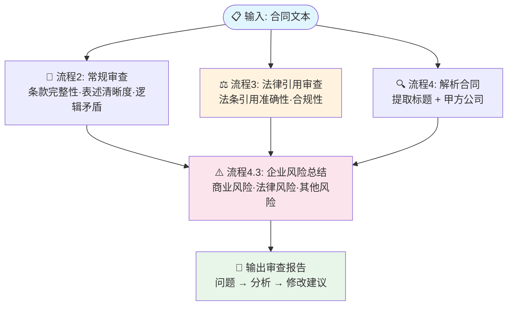

# 合同审阅助手

> 商业/法律风险识别 + 逐条修改建议

智能审阅合同文档，从商业、法律、合规等多维度识别风险点，并给出具体修改建议。

## 工作流架构



### 设计要点

- **三维审查**：常规审查（条款完整性） + 法律审查（法条合规性） + 商业审查（企业风险）
- **严格输出格式**：强制「问题 → 分析 → 修改建议」框架，避免 LLM 随意发挥
- **法条引用**：引用《民法典》等具体法条，增强建议可信度

## 功能特性

- 商业风险识别（付款条款、违约责任等）
- 法律风险识别（管辖权、仲裁条款等）
- 其他风险识别（数据安全、知识产权等）
- 逐条给出修改建议与替换措辞

## 项目结构

```
├── README.md
├── .gitignore
├── agent/
│   ├── prompt.md              # 主提示词
│   ├── workflow-prompts.md    # 工作流内嵌 Prompt
│   └── config.yaml
└── workflows/
    └── ht_0429.yaml
```

## 平台

基于 [Coze（扣子）](https://www.coze.com) 构建。

## 快速体验

👉 https://www.coze.cn/s/m75ilHMA104/
